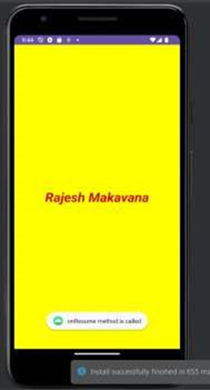
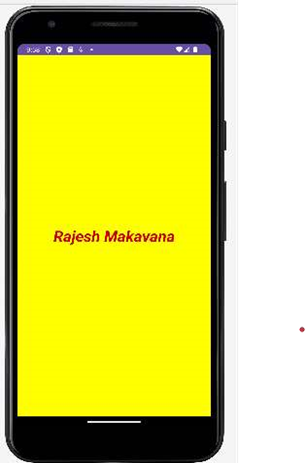

# MAD_P_2_21012011045

## AIM: 
Create Activity to display “Hello World” in TextView in the center of Activity screen with yellow (android:background="#FFFF00") layout background of Activity. 
TextView properties should be Holo Blue color (android:textColor=@android:color/holo_blue_bright), 27sp font size (android:textSize="27sp") and make text style bold and italic (android:textStyle="bold|italic"). 
After creating Activity, demonstrate functions of Activity Life Cycle by using Log message, Toast message & Snackbar message. All methods of Activity life cycle should be printed in Logcat.

## Screenshot

